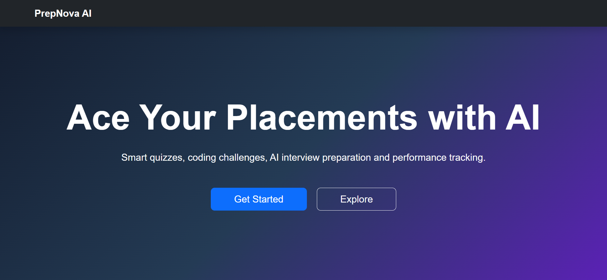

# Prep Nova

A placement preparation platform designed to help students practice Aptitude, Reasoning, Verbal, and Technical questions.

## Features
- Aptitude Practice
- Logical Reasoning
- Verbal Ability
- Technical MCQs
- User-friendly Interface

## Technologies Used
- HTML
- CSS
- JavaScript
- Django
- SQLite

## Screenshots
## Home Page

## Installation

1. Clone the repository
2. Install dependencies
3. Run the project

## Future Enhancements
- AI-based question recommendations
- Mock tests
- Performance analytics

## Author
Vyshnavi Eranti
