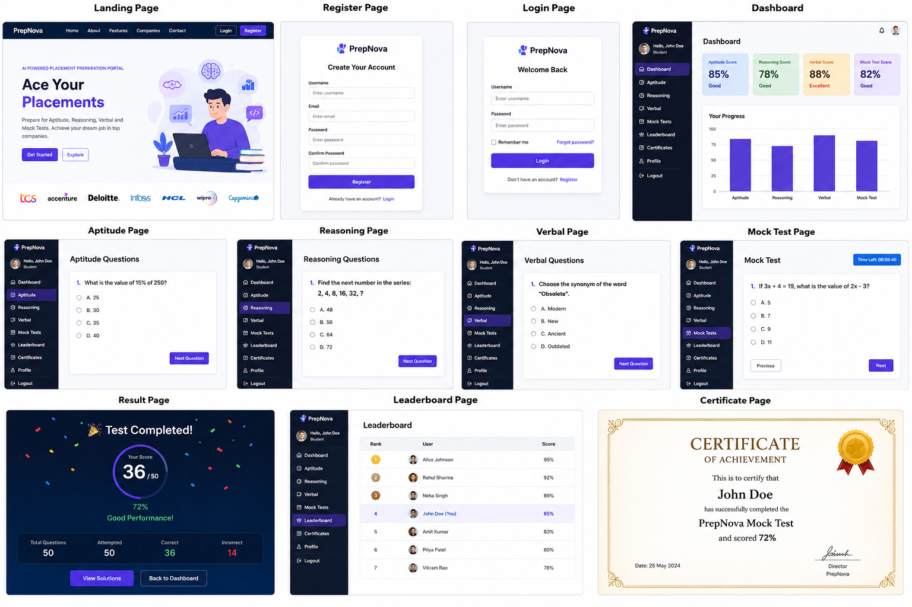

# 🚀 PrepNova – AI-Powered Placement Preparation Portal

## 📖 Overview

PrepNova is a comprehensive Placement Preparation Portal designed to help students prepare for campus placements efficiently. The platform provides practice modules for Aptitude, Reasoning, Verbal Ability, Coding, and Mock Tests, along with performance tracking and analytics.

Built using **Django**, **Python**, **Bootstrap 5**, **HTML**, **CSS**, and **JavaScript**, PrepNova offers an interactive and user-friendly learning experience.

---

## ✨ Features

### 🔐 User Authentication

* User Registration
* Secure Login & Logout
* Profile Management

### 📊 Student Dashboard

* Personalized Dashboard
* Performance Overview
* Progress Tracking

### 🧠 Aptitude Preparation

* Quantitative Aptitude Questions
* Multiple Choice Questions
* Practice Sets

### 🔍 Reasoning Practice

* Logical Reasoning
* Analytical Reasoning
* Puzzle-Based Questions

### 📚 Verbal Ability

* Synonyms & Antonyms
* Reading Comprehension
* Error Detection

### 📝 Mock Tests

* Timed Assessments
* Automatic Score Calculation
* Instant Results

### 🏆 Leaderboard

* Rank Students
* Compare Performance
* Track Improvement

### 📄 Certificate Generation

* Downloadable Completion Certificates
* Achievement Recognition

### 🎯 Company-Specific Preparation

* TCS
* Accenture
* Deloitte
* Infosys
* HCL
* Cognizant
* Wipro
* Capgemini

---

## 🛠️ Tech Stack

| Technology   | Purpose             |
| ------------ | ------------------- |
| Python       | Backend Development |
| Django       | Web Framework       |
| SQLite       | Database            |
| HTML5        | Structure           |
| CSS3         | Styling             |
| JavaScript   | Interactivity       |
| Git & GitHub | Version Control     |

---

## 📂 Project Structure

```text
PrepNova/
│
├── users/
├── dashboard/
├── aptitude/
├── reasoning/
├── verbal/
├── mocktests/
│
├── templates/
├── static/
│
├── manage.py
├── requirements.txt
└── db.sqlite3
```

---

## 📸 Screenshots

### 🏠 Output




## ⚙️ Installation

### Clone Repository

```bash
git clone https://github.com/your-username/PrepNova.git
```

### Navigate to Project

```bash
cd PrepNova
```

### Install Dependencies

```bash
pip install -r requirements.txt
```

### Apply Migrations

```bash
python manage.py makemigrations
python manage.py migrate
```

### Run Server

```bash
python manage.py runserver
```

### Open Browser

```text
http://127.0.0.1:8000/
```

---

## 🎯 Future Enhancements

* AI-Based Question Recommendations
* Resume Analyzer
* Interview Preparation Module
* Coding Compiler Integration
* Placement Prediction System
* Performance Analytics Dashboard

---

## 👩‍💻 Developed By

**Eranti Vyshnavi**

Aspiring Software Developer | Python & Django Enthusiast

---

## ⭐ Support

If you found this project useful, please consider giving it a ⭐ on GitHub.

